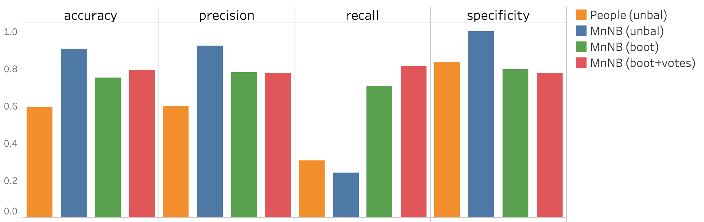

# Natural Language Processing, Visualized

</img>

1. [Overview](#1-goals--methods)
2. [Data](#2-data)
3. [Vectorization](#3-word2vec)
4. [Modeling](#4-modeling)
4. [Results](#results)

---

### 1. Goals & Methods
###### Goals:
- Predict the Subreddit from which a novel post originated based on its title and description text using natural language processing
- Evaluate the effects of different NLP techniques on model performance

###### Methods:
   1. **[Collect](#2-data)** post titles and description texts from two Subreddits
   2. **[Vectorize](#3-word2vec)** scraped data using natural language processing
   3. **[Train](#4-modeling)** binary classification models on the vectorized data
   4. **[Visualize](#experimenting-with-additional-parameters)** the effects of different engineered features, vectorization techniques, and machine learning models in Tableau

---

### 2. Data

I chose two Subreddits populated by natural language generative (NLG) bots and collected the title and descriptive text for all posts in each category using the `pushshift` Reddit API.

###### Class Overview:

|r/SubredditSimulator | r/SubSimulatorGPT2|
|-|-|
|`32,299` posts from 6/2015–1/2020 scraped in `240s`\*|`11,311` posts from 5/2019–1/2020 scraped in `118s`\*|
|`r/SS` uses Markov-chain natural-language-generation to "simulate" a subreddit by restricting posts and comments to a collection of pre-scripted bot accounts. This subreddit is intended to be watched, not interacted with. (*NLG trained on titles, descriptions, and comments from within Reddit only*) | `r/GPT2` is similar to (and was inspired by) r/SubredditSimulator, with the primary difference being that it uses GPT-2 as opposed to a simple markov chain model to generate the posts/comments. (*NLG trained on Reddit **plus** >40gb of data from other websites on the internet*)|
| *sample:*<blockquote>Before you watch Kingsman 2, watch Kingsman 2, watch Kingsman 2, watch Kingsman 2, watch Kingsman 2, watch Kingsman 3</blockquote> | *sample:* <blockquote>What's the difference between a Ralph Lauren Polo Ralph Lauren Polo Polo, and a Ralph Lauren Polo Ralph Lauren Polo?</blockquote>|

\*`pushshift` limits each query to 1,000 posts so I segmented scraping by month in r/SubredditSimulator (peak 688 posts/month) and thirds-of-months in r/SubSimulatorGPT2 (peak 2061 posts/month) with a 1-second delay between requests

## 3. word2vec

#### Count Vectorizing
The `CountVectorizer` module in `sklearn` returns a vector of the total count of each word in a corpus. By analyzing the respective frequencies of thousands words or phrases in different classes, a machine-learning model can predict the class of unfamiliar text based on the associations it "learned" between particular vectors (words) and the classes it trained on (`r/SS` vs. `r/GPT2` in my case).

Words like "the" and "of" appear so frequently they can create noise, obscuring those that appear less often but carry  more predictive value. We call these stop-words. Below, the top 5 words by total count in both Subreddits, including and then excluding stop-words.

</img>

As shown above, the word "the" appears more frequently in `r/GPT2` than in `r/SS`. This and similar variations in the count of stop-words between classes probably signifies an artifact of the respective natural language generative algorithms: for unknown reasons, the bots in `GPT2` employ certain stop-words at significantly different rates than do their `SS` counterparts. Given this finding, although we often remove stop-words in NLP, for this project stop-words may in fact prove useful to making predictions.

#### TF-IDF Vectorizing

Instead of manually identifying and removing stop-words, we may also wish to calculate term-frequency  inverse-document-frequency (TF*IDF) vectors. Term frequency (TF) represents the importance of a word within a given document (as a proportion of the total number of words in the document), while inverse document frequency (IDF) adds weight to terms depending on their importance (rarity) across all documents.

As a term appears in more and more documents, its TF-IDF vector approaches zero. The IDF curve for a hypothetical corpus of 100 documents below demonstrates how the IDF downgrades common words relative to those appearing in fewer documents.

<b>Inverse document frequency</b> | 100-document corpus 
</img>

 

**Calculating TF-IDF:** `This is an example sentence.` The TF for the term "example" here is `1/5` or `.2`. If the term "example" appears in a total of 15 documents in our 100-document corpus, the IDF curve above suggests a corresponding IDF of approximately `2`. Thus the TF-IDF vector for "example" in this sentence is `tf*idf = .2*2 = .4`.  

</img>
</img>

 

Finally I calculated a `mean TF-IDF score` for each vector by taking the average of scores in documents where the term scored `.1` or greater (adapted from a technique described in <a href="http://www.cs.nott.ac.uk/~pszjds/research/files/dls_ukci2014.pdf" target="blank">this paper</a>). Applying a minimum threshold to the calculation of the mean avoids over-counting stop-words that appear so frequently their mean score skews high; this calculated metric is intended to approximate the average importance of a term across the entire corpus.

### Bootstrapping

By "bootstrapping" random samples of `r/GPT2` data (initially 11,311 posts), I created a dataframe of nearly three times that number to match the quantity of posts from `r/SS` (32,299). Bootstrapping requires sampling **with replacement** because we scale up with duplicates from the initial data. Below, a simplification: taking initially unbalanced classes of 5:2 and  bootstrapping up to 5:5 to balance the data.
  

</img>

 

# 4. Modeling

With our data vectorized, we are ready to model. With many features, a traditional logistic regression model is likely to exhibit high variance, so I started by fitting with Ridge Regression (logistic regression with an `l2` penalty) to address potential multicollinearity issues.

Assessing the model's vector coefficients revealed a surprising relationship between beta values and mean TF-IDF scores. For a handful of terms with relatively small mean TF-IDF scores, Ridge found remarkably large magnitudes for their coefficients. I speculate that Ridge calculated larger beta values for these terms to counteract their smaller vector values because they carry more predictive power than TF-IDF initially suggested.

</img>
 

### Experimenting with additional Parameters

Finally I created an interactive dashboard in Tableau to allow manipulation of multiple NLP parameters in tandem. The dashboard incorporates data from multiple vectorization techniques and models and allows searching for words or phrases to show how specific vectors contribute to model.

<a href="https://public.tableau.com/profile/joe.fitzgerald#!/vizhome/Project3book/Story2?publish=yes" target="blank"><h3 align='center'>visit the interactive dashboard ➞</h3></a>

<a href="https://public.tableau.com/profile/joe.fitzgerald#!/vizhome/Project3book/Story2?publish=yes" target="blank"></img></a>

### Results

I aimed to optimize for `recall`, or the ability to positively identify posts authored by `GPT2`-based bots. Because the NLG tech behind `r/GPT2` is more advanced than in `r/SS`, it is fairly easy for a human to guess which algorithm is responsible for a sample of text. I sought to build a model that could make similar predictions between the two classes of AI authors.

With just a quarter of the initial data coming from `r/GPT2`, my first model failed to reliably identify instances of the positive class. To further understand the effects of unbalanced classes I also tested 15 of my classmates on a similar challenge. Participants were given 2 minutes to read 10 randomly-sampled posts from each class with labels included, then 2 minutes to guess the classes for 10 new, unlabeled posts. Participants were not aware that the testing data had been sampled from unbalanced data. The summed results of these tests are plotted below, in addition to scores for a few of the best-performing machine learning models

</img>

Multinomial Naive Bayes classification models are less intuitive when it comes to interpreting coefficients (see slide three of the [interactive dashboard](https://public.tableau.com/profile/joe.fitzgerald#!/vizhome/Project3book/Story2?publish=yes)), but applying the technique yielded slightly better results than Ridge so I plotted these scores above. The chart also demonstrates how bootstrapping significantly improved the model's recall capabilities.

The final iteration of my model achieved a recall score of above 80% after eliminating posts with zero human interaction. While posting and commenting in the simulated Subreddits is restricted to bots, people are allowed to vote and interact with content in other indirect ways. Filtering only for posts with some kind of human interaction  narrowed the dataset down to what might be considered a more representative sample of each class of bots.

#### Conclusions:
- As demonstrated in the trade-off between Ridge coefficient magnitudes and mean TF-IDF scores, data processing and data modeling cannot be considered in isolation but must be considered as part of one larger process.
- Unbalanced classes can significantly decrease model performance. This is not just a problem for machines but also for people when it comes to predicting new data.
- Although Multinomial Naive Bayes models are harder to interpret than logistic regression models, they yielded the highest recall scores out of all the model assembled for this project.
- Further research is required to understand the artifacts in NLG-produced text.
